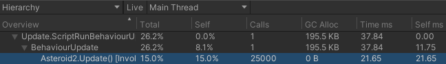
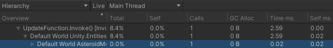

# DOTS-Assignment
 
## About
The assignment is about utilizing Unity DOTS to make an asteroids game as optimized as possible. DOTS have a lot of features that can be utilized to make the game run as smooth as possible. The 3 big ones are:
- ECS, another way of structuring your code. It separates data from logic and works well with many entities.
- Jobs, can do multiple tasks at the same time, taking advantage of multi-core CPU's.
- Burst Compiler, it's faster than the normal compiler, taking advantage of modern CPU architecture.

## Controls
The controls are:
- [Move] ↑W and S↓
- [Rotate] ↶A and D↷
- [Shoot] Space

## Performance
Before optimizing, I reach ~10fps with 25k entities.

After optimizing, I reach ~30fps with 25k entities.

## Optimization
Before optimizing, I noticed that the code responsible for moving the asteroids was way too slow. **ALL** of the processes each frame has to take ~16.67ms for the game to run at 60FPS. As showcased below, the movement of the asteroids alone take more time than that.

To optimize it, converted the code to DOTS, utilizing many of it's features like burst compiling and jobs to increase the efficiency as much as possible. Because I now instead use ECS, the movement of the asteroids are moved away from the [Asteroid](https://github.com/KristofferSaxmo/DOTS-Assignment/blob/main/Assets/NotDOTS/Scripts/Asteroid2.cs) class to [AsteroidMovementSystem](https://github.com/KristofferSaxmo/DOTS-Assignment/blob/main/Assets/DOTS/Scripts/Asteroid/AsteroidMovementSystem.cs), which handles the movement for all of the asteroids in its update loop.

The results are really, really good. Instead of 20ms, it now takes 0.02ms to move 25k asteroids. Parallel jobs are to thank for this, allowing the proccess to be divided into multiple threads, therefore saving lots of valuable time.

